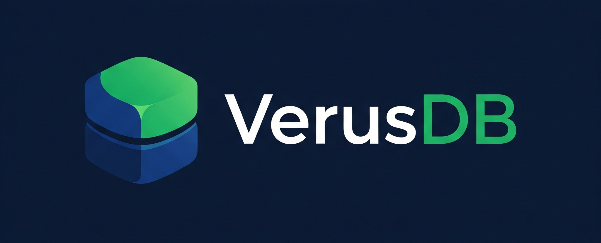

# VerusDB - Secure Embedded Database for Node.js

<div align="center">
  
</div>

[](https://opensource.org/licenses/MIT)
[](https://nodejs.org/)
[](package.json)
[](https://github.com/irfangunl/VerusDB)

VerusDB is a lightweight, embedded database built specifically for Node.js applications that need security and simplicity. Everything is stored in a single encrypted `.vdb` file, making it perfect for desktop apps, prototypes, and small to medium-scale projects.

What makes VerusDB special? It's designed with developers in mind - no complex setup, no separate database server, just install and start building. Plus, it comes with a sleek web-based admin panel that makes managing your data a breeze.

## 🌟 Why VerusDB?

I started working on VerusDB because I was tired of setting up heavy database servers for every small project. Sometimes you just want to build something quickly without worrying about database administration, connection strings, or deployment complexity.

**Perfect for:**
- **Desktop Applications**: Electron apps, Node.js desktop tools
- **Rapid Prototyping**: Get your idea off the ground fast
- **Small Web Apps**: Personal projects, internal tools, demos
- **Local Development**: No need to install and configure database servers
- **Portable Apps**: Everything in one file, easy to backup and move

**Key Features:**
- 🔒 **Built-in Encryption**: Your data is secure with AES-256 encryption
- 📱 **Beautiful Admin Panel**: Manage your data through a modern web interface
- 🚀 **Zero Configuration**: Install and start using immediately
- 📦 **Single File Database**: Everything stored in one portable `.vdb` file
- 🎯 **Schema Validation**: Define your data structure and enforce it
- 🔍 **Powerful Queries**: MongoDB-style queries with full-text search
- 🏗️ **Production Ready**: Comprehensive logging, monitoring, and deployment features

## 📦 Getting Started

### Installation

```bash
npm install verusdb
```

### Your First Database

Here's how to get up and running in under 2 minutes:

```javascript
const VerusDB = require('verusdb');

async function main() {
  // Create your database
  const db = new VerusDB({
    path: './my-app.vdb',
    encryptionKey: 'your-secret-key-here'
  });

  await db.init();

  // Define your data structure
  await db.createCollection('users', {
    schema: {
      name: { type: 'string', required: true },
      email: { type: 'string', required: true, unique: true },
      age: { type: 'number', min: 0, max: 150 },
      active: { type: 'boolean', default: true }
    },
    indexes: ['email'] // Make queries fast
  });

  // Add some data
  const user = await db.insert('users', {
    name: 'John Doe',
    email: 'john@example.com',
    age: 30
  });

  console.log('Created user:', user);

  // Find your data
  const activeUsers = await db.find('users', { active: true });
  console.log('Active users:', activeUsers.length);

  // Update records
  await db.update('users', 
    { email: 'john@example.com' }, 
    { $set: { age: 31 } }
  );

  console.log('User updated!');
}

main().catch(console.error);
```

### Launch the Admin Panel

Want a GUI? Launch the web admin panel:

```javascript
// Add this to your existing code
const server = await db.serveAdmin({ 
  port: 4321,
  host: 'localhost'
});

console.log(`🎉 Admin panel ready at ${server.url}`);
```

Then open your browser to `http://localhost:4321` and explore your data visually!

## 📋 Schema Definition

VerusDB uses a flexible schema system to define document structure:

```javascript
const userSchema = {
  // String field with validation
  username: {
    type: 'string',
    required: true,
    minLength: 3,
    maxLength: 20,
    unique: true
  },
  
  // Number field with range
  age: {
    type: 'number',
    min: 0,
    max: 150,
    required: true
  },
  
  // Enum field
  role: {
    type: 'string',
    enum: ['user', 'admin', 'moderator'],
    default: 'user'
  },
  
  // Encrypted field
  socialSecurityNumber: {
    type: 'string',
    encrypted: true  // Field-level encryption
  },
  
  // Array field
  tags: {
    type: 'array',
    default: []
  },
  
  // Date field with default
  createdAt: {
    type: 'date',
    default: () => new Date()
  },
  
  // Custom validation
  email: {
    type: 'string',
    required: true,
    validate: (email) => {
      const emailRegex = /^[^\s@]+@[^\s@]+\.[^\s@]+$/;
      return emailRegex.test(email) || 'Invalid email format';
    }
  }
};
```

## 🔍 Querying Your Data

VerusDB uses familiar MongoDB-style queries, so if you've used MongoDB before, you'll feel right at home:

```javascript
// Simple queries
const adults = await db.find('users', { age: { $gte: 18 } });
const admins = await db.find('users', { role: 'admin' });

// Complex conditions
const activeAdults = await db.find('users', {
  $and: [
    { active: true },
    { age: { $gte: 18, $lt: 65 } },
    { role: { $in: ['user', 'admin'] } }
  ]
});

// Text search
const johns = await db.find('users', { 
  name: { $regex: 'john', $options: 'i' } 
});

// Find one
const user = await db.findOne('users', { email: 'john@example.com' });

// Count records
const userCount = await db.count('users', { active: true });
```
  ]
});

// Sorting and pagination
await db.find('users', {}, {
  sort: { createdAt: -1 },
  limit: 10,
  skip: 20
});
```

## 🔄 Update Operations

```javascript
// Set fields
await db.update('users', 
  { _id: userId }, 
  { $set: { lastLogin: new Date() } }
);

// Increment numbers
await db.update('users', 
  { _id: userId }, 
  { $inc: { loginCount: 1 } }
);

// Array operations
await db.update('users', 
  { _id: userId }, 
  { $push: { tags: 'premium' } }
);

await db.update('users', 
  { _id: userId }, 
  { $pull: { tags: 'trial' } }
);
```

## 🛠️ Command Line Tools

VerusDB comes with handy CLI tools for managing your databases:

### View Database Schema
```bash
npx verusdb schema --path ./my-app.vdb --key your-secret-key
```

### Export Your Data
```bash
# Export everything to JSON
npx verusdb export --path ./my-app.vdb --key your-secret-key --to backup.json

# Export just one collection to CSV
npx verusdb export --path ./my-app.vdb --key your-secret-key --to users.csv --format csv --collection users
```

### Start Admin Panel
```bash
npx verusdb serve --path ./my-app.vdb --key your-secret-key --port 4321
```

### Create Backups
```bash
npx verusdb backup --path ./my-app.vdb --key your-secret-key --output ./backup.vdb
```

### Interactive Shell
```bash
npx verusdb shell --path ./my-app.vdb --key your-secret-key
```

## 🔐 Security Features

Security was a top priority when building VerusDB:

- **🔒 File-level Encryption**: Your entire database file is encrypted with AES-256
- **🛡️ Field-level Encryption**: Mark specific fields as encrypted for extra security
- **🔑 Strong Key Derivation**: Uses PBKDF2 with 100,000 iterations
- **✅ Tamper Detection**: SHA-256 checksums verify file integrity
- **🌐 Admin Panel Security**: Secure session management and HTTPS support

## 🚀 Production Ready

VerusDB isn't just for prototypes - it's built for production use:

- **📊 Comprehensive Logging**: Structured JSON logs with performance metrics
- **🏥 Health Monitoring**: Built-in health checks and monitoring endpoints
- **🐳 Docker Support**: Ready-to-use Docker containers and compose files
- **⚡ Performance**: Optimized for speed with configurable caching
- **🔄 Backup & Recovery**: Automated backup systems and data export tools

See our [Production Deployment Guide](PRODUCTION_READY.md) for detailed setup instructions.

## 📊 Import/Export Formats

VerusDB supports importing and exporting data in multiple formats:

### JSON
```javascript
// VerusDB format
{
  "version": 1,
  "collections": {
    "users": {
      "schema": { /* schema definition */ },
      "documents": [ /* documents array */ ]
    }
  }
}

// MongoDB format (array of documents)
[
  { "_id": "123", "name": "John", "email": "john@example.com" }
]
```

### CSV
```csv
name,email,age,active
John Doe,john@example.com,30,true
Jane Smith,jane@example.com,25,true
```

### SQL
```sql
CREATE TABLE users (
  _id VARCHAR(255) PRIMARY KEY,
  name VARCHAR(255) NOT NULL,
  email VARCHAR(255) UNIQUE NOT NULL,
  age INT,
  active BOOLEAN DEFAULT TRUE
);

INSERT INTO users VALUES ('123', 'John Doe', 'john@example.com', 30, TRUE);
```

## 🧪 Examples

### Todo Application
```bash
node examples/todo-app/index.js
```

A complete todo application demonstrating:
- Collection creation with schema
- CRUD operations
- Searching and filtering
- Statistics and reporting
- Admin panel integration

### Blog CMS
```bash
node examples/blog-cms/index.js
```

A simple blog content management system showing:
- Multiple related collections
- File attachments
- User authentication
- Content publishing workflow

## 🏗️ How it Works

VerusDB is designed to be simple but powerful:

```
Your App
    ↓
VerusDB API  ←→  .vdb file (encrypted)
    ↓
Admin Panel (optional)
```

**Core Components:**
- **Database Engine**: Handles all data operations and queries
- **Encryption Layer**: Keeps your data secure with AES-256
- **Schema Validator**: Ensures data consistency  
- **Admin Panel**: Optional web interface for data management
- **CLI Tools**: Command-line utilities for automation

Everything is stored in a single `.vdb` file that you can easily backup, move, or version control.

## 🚀 Production Deployment

Ready to deploy? VerusDB has you covered:

### Docker Deployment (Recommended)

```bash
# Quick start with Docker
docker run -d \
  -p 4321:4321 \
  -v $(pwd)/data:/app/data \
  -e VDB_PASSWORD=your-secure-password \
  your-verusdb-app
```

### Manual Deployment

```bash
# Install dependencies
npm install --production

# Set environment variables
export NODE_ENV=production
export VDB_PASSWORD=your-secure-password
export VDB_LOG_LEVEL=info

# Start your app
node index.js
```

For detailed production setup, monitoring, and scaling guides, check the Docker and deployment examples in this repository.

### Environment Configuration

```bash
# Required for production
NODE_ENV=production
VDB_PASSWORD=your-secure-database-password
ADMIN_USERNAME=admin
ADMIN_PASSWORD=secure-admin-password
ADMIN_JWT_SECRET=your-jwt-secret

# Optional configurations
PORT=3000
ADMIN_PORT=4000
LOG_LEVEL=info
ENABLE_PERFORMANCE_MONITORING=true
CORS_ORIGINS=https://yourdomain.com
```

### Health Checks

```bash
# Application health
curl http://localhost:3000/health

# Admin panel health
curl http://localhost:4000/health

# Response: {"status": "healthy", "database": "connected", "uptime": 1234}
```

## 🔧 Configuration

```javascript
const db = new VerusDB({
  // Database file path
  path: './data.vdb',
  
  // Encryption key
  encryptionKey: 'your-secret-key',
  
  // Auto-save interval (ms)
  autoSaveInterval: 5000,
  
  // Maximum file size (bytes)
  maxFileSize: 1024 * 1024 * 100, // 100MB
  
  // Compression level (0-9)
  compressionLevel: 6
});
```

## 📈 Performance

- **Small footprint**: < 5MB package size
- **Fast queries**: In-memory indexes for quick lookups (~625 ops/second)
- **Efficient storage**: Compressed data with minimal overhead
- **Scalable**: Handles databases up to several GB
- **Low latency**: No network overhead for local operations
- **Memory efficient**: Optimized garbage collection and resource management

## 🧪 Testing

I've written extensive tests to make sure VerusDB is reliable:

```bash
# Run all tests (42 passing!)
npm test

# Check test coverage
npm run test:coverage
```

The test suite covers everything from basic operations to edge cases, encryption, file corruption handling, and production scenarios.

## 🤝 Contributing

Found a bug or have an idea? I'd love your help!

1. Fork the repository
2. Create a feature branch (`git checkout -b amazing-feature`)
3. Make your changes
4. Add tests if needed
5. Run the test suite (`npm test`)
6. Submit a pull request

## 📄 License

MIT License - feel free to use VerusDB in your projects!

## 🆘 Need Help?

- **📖 Questions?** Check the [examples](examples/) folder for working code
- **🐛 Found a bug?** [Open an issue](https://github.com/irfangunl/VerusDB/issues)
- **💡 Feature idea?** [Start a discussion](https://github.com/irfangunl/VerusDB/discussions)
- **📧 Contact:** irfangunel4@gmail.com

## 🗺️ What's Next?

I'm actively working on VerusDB and have some exciting features planned:

- **v1.1**: Real-time subscriptions and live queries
- **v1.2**: Multi-database support
- **v1.3**: Clustering and replication
- **v1.4**: GraphQL API
- **v1.5**: Browser support via WebAssembly

---

**Thanks for checking out VerusDB!** I hope it makes your development life a little easier. If you build something cool with it, I'd love to hear about it! 🚀